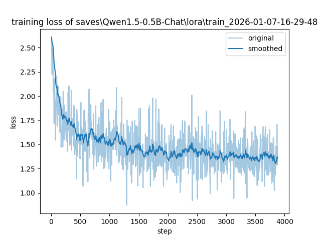

**越南语语种的多模态数据资源在昇腾AI开发板上运行应用**

# Vietnamese Chatbot

基于 Qwen1.5-0.5B-Chat 的越南语 LoRA 微调对话系统


## 项目简介

本项目使用万卷丝绸数据集（WanJuanSiLu2O）的越南语部分，通过 LoRA（Low-Rank Adaptation）微调技术，在 Qwen1.5-0.5B-Chat 基础模型上训练出一个越南语对话机器人。可以在香橙派AIpro（昇腾310B 16G 8T）上进行推理部署。

## 技术栈

| 组件 | 技术 |
|------|------|
| 基础模型 | Qwen1.5-0.5B-Chat (0.5B 参数) |
| 微调方法 | LoRA (Low-Rank Adaptation) |
| 训练框架 | LlamaFactory |
| 训练数据 | 万卷丝绸数据集越南语部分 (~23,000 条) |
| MindSpore 推理 | MindSpore 2.6.0 + MindSpore NLP 0.4.1 |


## 目录结构

```
vietnamese-chatbot/
├── 01_environment_setup.ipynb          # 环境配置、数据集下载、LlamaFactory 安装
├── 02_data_processing_and_training.ipynb  # 数据格式转换、模型训练
├── 03_inference_mindspore.ipynb        # 昇腾 AI + MindSpore 推理
├── README.md                           # 项目说明文档
├── Model/                              # (需要下载) 模型文件目录
│   ├── Qwen1.5-0.5B-Chat/              # 基础模型
│   ├── Vietnamese-LoRA-Only/           #  训练后的LoRA 适配器
│   ├── lora-train_2026-01-07-16-29-48/ #  本地训练后的LoRA 适配器
│   └── Lora-Tach/                      # 合并后的模型
└── TargetData/                         # (需要下载与转换) WanJuanSiLu2O 数据集
    ├── raw/.../vi.jsonl                # 原始越南语数据
    └── processed/dialogue_format/
        ├── train.json                  # 训练集 (20,699 条)
        └── val.json                    # 验证集 (2,300 条)
```


## 快速开始

### 环境要求


**推理端：香橙派AIpro 16G 8T 昇腾310**
- Python 3.10+
- MindSpore 2.6.0
- MindSpore NLP 0.4.1
- CANN 8.1.RC1

### 安装依赖

```bash

# MindSpore 版本
pip install mindspore==2.6.0 mindnlp==0.4.1
```

## 训练流程

### 1. 环境准备 (`01_environment_setup.ipynb`)

配置 Python 环境，检查 GPU 状态，安装 LlamaFactory 训练框架。

```bash
# 安装 LlamaFactory
git clone --depth 1 https://github.com/hiyouga/LlamaFactory.git
cd LlamaFactory
pip install -e .
```

### 2. 数据集下载

使用 OpenXLab 下载万卷丝绸越南语数据集：

```bash
pip install openxlab
openxlab dataset download -r OpenDataLab/WanJuanSiLu2O -s /raw/sft/vi --target-path ./TargetData/raw/
```

### 3. 数据处理 (`02_data_processing_and_training.ipynb`)

将原始 JSONL 数据转换为 LlamaFactory 所需的指令格式：

```python
# 输入格式
{"prompt": "问题", "completion": "答案"}

# 输出格式
{"instruction": "问题", "input": "", "output": "答案"}
```

按 9:1 分割训练集和验证集，最终得到：
- 训练集：20,699 条
- 验证集：2,300 条

### 4. 模型训练

使用 LlamaFactory WebUI 进行训练配置：

```bash
llamafactory-cli webui
```

访问 http://localhost:7860 进行训练配置。

**训练参数建议：**
- 基础模型：Qwen1.5-0.5B-Chat
- 微调方法：LoRA
- LoRA Rank：8-16
- LoRA Alpha：16-32
- 学习率：5e-5 ~ 1e-4
- 训练轮数：3-5 epochs
- 最大序列长度：512-1024

## 推理部署

## Model 模块说明

本目录包含项目使用的模型文件，已上传至 modelers 社区。

### Qwen1.5-0.5B-Chat
- **Git 地址**: https://modelers.cn/yaemika/Qwen1.5-0.5B-Chat.git
- **访问地址**: https://modelers.cn/models/yaemika/Qwen1.5-0.5B-Chat
- **说明**: Qwen1.5 0.5B 对话模型，作为基础模型使用
- **大小**: ~1.2 GB
- **文件**: model.safetensors, tokenizer 配置等

### Lora-Tach
- **Git 地址**: https://modelers.cn/yaemika/vietnamese-chatbot.git
- **访问地址**: https://modelers.cn/models/yaemika/vietnamese-chatbot
- **说明**: 基于 Qwen 微调的越南语对话模型（已合并）
- **大小**: ~900 MB
- **文件**: model.safetensors, tokenizer 配置等

### Vietnamese-LoRA-Only
- **Git 地址**: https://modelers.cn/yaemika/Vietnamese-LoRA-Only.git
- **访问地址**: https://modelers.cn/models/yaemika/Vietnamese-LoRA-Only
- **说明**: Vietnamese LoRA 适配器模型（独立版本）
- **大小**: ~15 MB
- **文件**: adapter_model.safetensors, adapter_config.json, tokenizer 配置等

### lora-train_2026-01-07-16-29-48
- **说明**: 本地训练输出的 LoRA adapter
- **状态**: 已上传至 modelers.cn (Vietnamese-LoRA-Only)

### MindSpore 推理 (`03_inference_mindspore.ipynb`)

- 适用于昇腾 AI 平台，使用 MindSpore + MindSpore NLP。
- 在香橙派AIpro 16G 8T，**MindSpore**2.6.0+**MindSpore NLP**0.4.1验证通过
```python
from mindnlp.transformers import AutoModelForCausalLM, AutoTokenizer
from mindnlp.peft import PeftModel

# 加载基础模型和 LoRA 适配器
tokenizer = AutoTokenizer.from_pretrained("yaemika/Qwen1.5-0.5B-Chat",mirror="modelers", ms_dtype=mindspore.float16)
omodel = AutoModelForCausalLM.from_pretrained("yaemika/Qwen1.5-0.5B-Chat", mirror="modelers", ms_dtype=mindspore.float16)
lora_path = "./Model/Vietnamese-LoRA-Only"
loramodel = PeftModel.from_pretrained(omodel, lora_path)
```

### 对话示例

```
You> Xin chào!
Bot> Xin chào! Tôi có thể giúp gì cho bạn?

You> Nguồn gốc tục thờ cúng tổ tiên của người Việt?
Bot> Tục thờ cúng tổ tiên có nguồn gốc từ nền kinh tế nông nghiệp...
```

## 项目特点

- ✅ 昇腾平台支持：支持昇腾AI， 香橙派AIpro 16G 8-12T开发板
- ✅ 参数高效微调：使用 LoRA 技术，降低训练成本
- ✅ 流式推理：支持实时 token 输出，提升交互体验
- ✅ 对话历史管理：支持多轮对话上下文
- ✅ 完整流程：从数据处理到模型训练再到推理部署的端到端方案

## 许可证

本项目使用的数据集和模型遵循相应的开源许可证。
